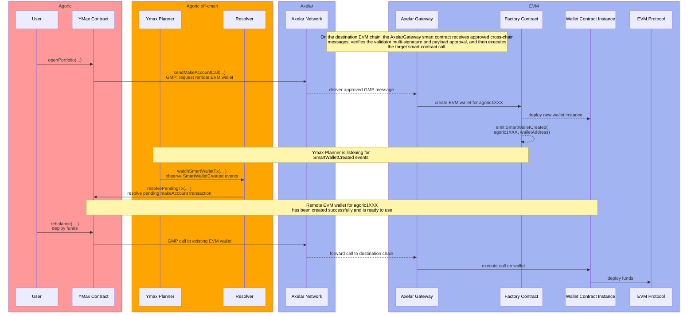

```mermaid
sequenceDiagram

 box rgb(255,153,153) Agoric
  participant User as User
  participant YMaxContract as YMax Contract
 end

 box  rgb(255,165,0) Agoric off-chain
  participant YP as Ymax Planner
  participant Res as Resolver
 end

 box rgb(163,180,243) Axelar
  participant Axelar as Axelar Network
 end

 box rgb(163,180,243) EVM
  participant AxelarGateway as Axelar Gateway
  participant Factory as Factory Contract
  participant Wallet as Wallet Contract Instance
  participant EVMProtocol as EVM Protocol
 end

 Note over AxelarGateway: On the destination EVM chain, the AxelarGateway smart contract receives approved cross-chain<br> messages, verifies the validator multi-signature and payload approval, and then executes<br> the target smart-contract call.

 %% ============================
 %% Wallet creation (one-time)
 %% ============================
 User->>YMaxContract: openPortfolio(...)
 YMaxContract->>Axelar: sendMakeAccountCall(...)<br/>GMP: request remote EVM wallet
 Axelar-->>AxelarGateway: deliver approved GMP message
 AxelarGateway->>Factory: create EVM wallet for agoric1XXX
 Factory-->>Wallet: deploy new wallet instance

 %% SmartWalletCreated event (on-chain)
 Factory-->>Factory: emit SmartWalletCreated(<br/>agoric1XXX, walletAddress)
 Note over Factory,YP: Ymax-Planner is listening for<br/>SmartWalletCreated events

 %% Off-chain reaction to event
 YP->>Res: watchSmartWalletTx(... )<br/>observe SmartWalletCreated events
 Res->>YMaxContract: resolvePendingTx(... )<br/>resolve pending makeAccount transaction

 %% Remote wallet is now ready
 Note over YMaxContract,Wallet: Remote EVM wallet for agoric1XXX<br/>has been created successfully and is ready to use

 %% ============================
 %% Wallet usage (rebalance)
 %% ============================
 User->>YMaxContract: rebalance(... )<br/>deploy funds
 YMaxContract->>Axelar: GMP call to existing EVM wallet
 Axelar-->>AxelarGateway: forward call to destination chain
 AxelarGateway->>Wallet: execute call on wallet
 Wallet->>EVMProtocol: deploy funds

```
