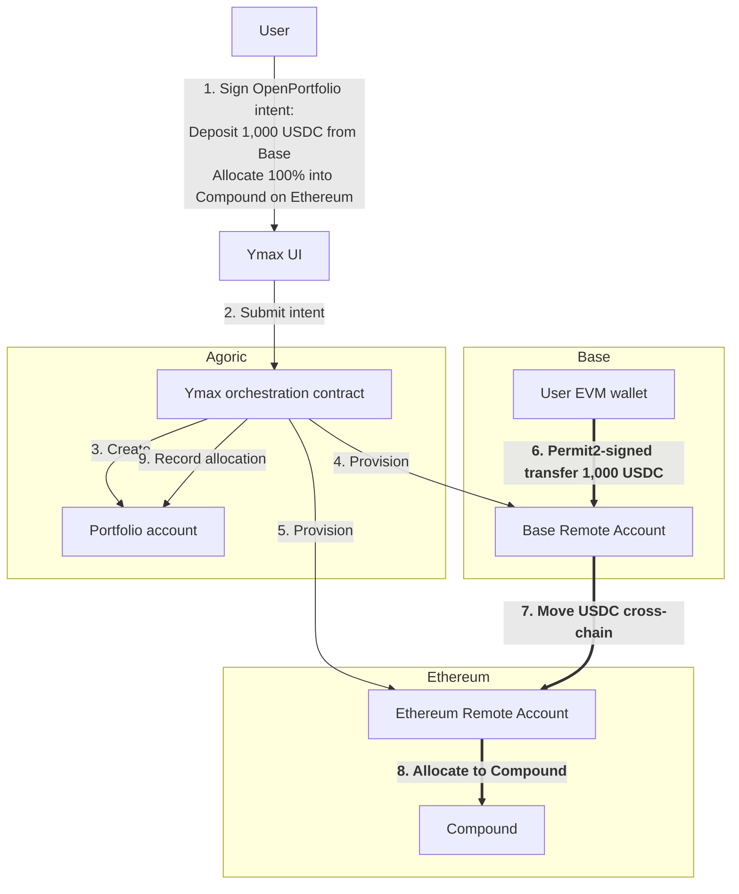
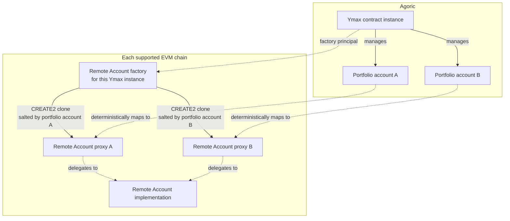
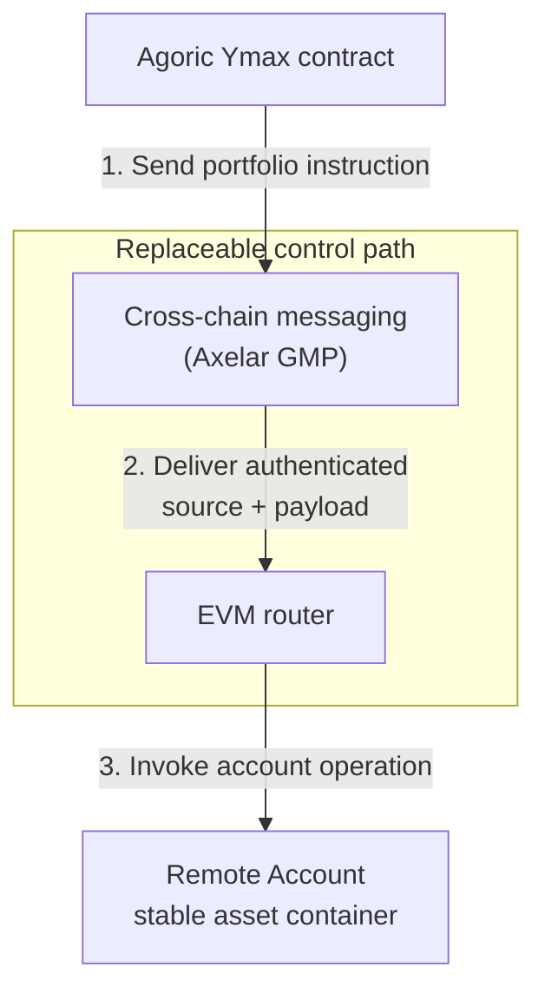
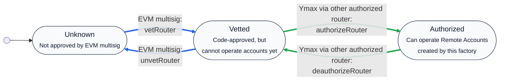
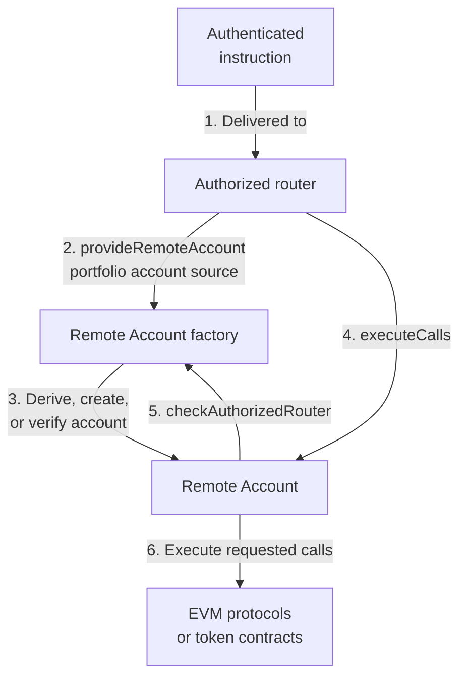
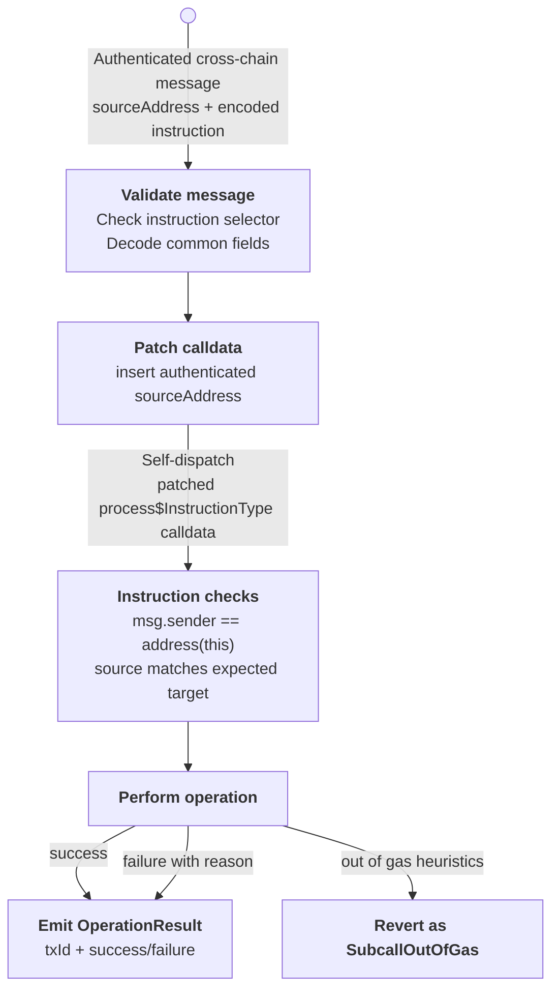

# Ymax EVM Remote Accounts

**Stable Asset Containers for Cross-Chain Portfolio Orchestration**

## The problem: one user intent, many chain-specific actions

Ymax is a non-custodial portfolio management dapp that turns a single signed user intent into a coordinated sequence of actions across multiple chains.

A user may express a high-level goal, such as depositing funds, rebalancing a portfolio, or entering positions across several EVM chains. The system then needs to execute those actions while preserving three properties:

- The user’s assets remain segregated from other users’ assets.
- The system does not take custody through a shared omnibus account.
- The user does not need to manually operate accounts on every destination chain.

Ymax solves this by combining an orchestration contract on the Agoric blockchain with per-portfolio Remote Account contracts on each supported EVM chain.

Example of an orchestrated flow for a user opening a portfolio:

## The core design: assets should outlive execution paths

The key architectural choice is to separate the contracts that hold assets from the machinery used to operate them.

The asset-holding side needs to be boring and durable. A portfolio's account on Base or Ethereum should keep the same address over time, so the system is not constrained by assets that may be locked in place, and so users can more easily audit their holdings in block explorers.

The execution side has different pressures. Cross-chain messaging providers can change, instruction formats can evolve, and new ways of interacting with EVM accounts may become useful. Those changes should be applicable to existing portfolio accounts, rather than requiring every portfolio to move assets into a new account.

Ymax therefore treats each EVM Remote Account as a stable object. Everything else in the system is organized around safely creating those accounts, sending authenticated instructions to them, and observing the results of those instructions.

## Remote Accounts: per-portfolio asset ownership on EVM chains

The important property of a Remote Account is not just that it exists on an EVM chain. It is that its address is derived from the Agoric Ymax contract instance and the portfolio account it represents.

To achieve that, Remote Accounts are created by a factory contract with their addresses deterministically derived from:

- the Remote Account factory address;

- the immutable Remote Account implementation address;

- the Agoric portfolio account address.

An Agoric account address alone is not sufficient to identify an account as belonging to a Ymax portfolio. That responsibility falls to the factory, which serves as the root contract provisioning Remote Accounts for a specific Agoric Ymax contract instance. By combining all addresses, Remote Accounts are uniquely tied to the Agoric portfolio account.

The deterministic derivation also gives the system idempotent provisioning: the same portfolio on the same EVM chain always maps to the same Remote Account address. The system can safely check whether the account already exists, deploy it if needed, and compute deposit destinations before assets move.

Remote Accounts are deployed as EIP-1167 minimal-proxy clones, allowing each account to have a stable address and isolated asset ownership without requiring full contract bytecode deployment for every portfolio. This also makes it easier for users to identify and verify the contract holding their assets.

## Routers: authenticated instruction delivery

Because Remote Accounts are meant to be stable asset containers, they do not embed or trust a single cross-chain messaging path directly. Instead, instructions arrive through router contracts.

A router implements a cross-chain messaging integration, currently [Axelar General Message Passing (GMP)](https://docs.axelar.dev/dev/general-message-passing/overview/), and receives authenticated payloads from the Ymax orchestration contract. The messaging layer, or the router itself, must ensure that messages are authentic, non-replayable, and tied to the correct source account. This avoids confused deputy problems where a router could be tricked into executing instructions from an impostor.

There is no ordering guarantee, and the Ymax orchestration contract is responsible for avoiding concurrent execution of non-independent instructions.

The router is not just a dumb pipe to Remote Accounts. It exposes high-level instructions that the Ymax orchestration contract uses to provision accounts, process deposits, execute account operations, and administer router authorization.

## Router authorization: changing control paths without moving assets

Routers and Remote Accounts are not directly linked. Instead, the factory plays a mediator role.

The router uses the factory to derive the Remote Account address from the Agoric portfolio account address.

Remote Accounts do not hold mutable configuration state; they statically defer to the factory for router checks. The factory solely maintains the authorization state that defines whether Remote Accounts accept calls from routers.

This gives Ymax a controlled upgrade path without having to individually upgrade every portfolio account, migrate assets, or change Remote Account addresses. Existing Remote Accounts are atomically authorized to accept instructions through a new router once that router has been approved.

This authorization is protected by a two-factor mechanism maintained by the non-upgradable factory:

- an EVM multisig must first vet the new router;
- the managing Ymax orchestration contract must send an admin instruction through an existing authorized router to enable the newly vetted router.

This means that the compromise of a single router, or even the compromise of an underlying cross-chain messaging system, should not by itself authorize a completely new control path for all Remote Accounts. An already authorized router remains highly privileged, so router code and messaging authentication are still critical trust boundaries.

Routers can also be deauthorized and un-vetted when retired. The multisig vetting authority can be updated as well after a similar two-step process: a proposal by the current vetting authority and a confirming admin instruction from the Agoric-side Ymax contract.

In the future, this model can support multiple concurrent interaction paths, potentially including direct EVM user wallet access behind a timelock, without changing where assets are held.

## Deposits as intents

Deposits are intents processed as a router instruction rather than as separate token transfers.

This leverages Permit2 signed transfers, with the router acting as the Permit2 spender. Because the router is tied to the Remote Account factory for a Ymax instance, its EVM address can represent that Ymax instance when a user signs a Permit2 authorization.

The router enforces that a deposit instruction can only come from the factory principal: the Agoric blockchain Ymax orchestration contract instance associated with that factory. This prevents an attacker from taking a permit intended for the Ymax system and redirecting funds into an unrelated Remote Account. The factory’s deterministic address computation anchors the deposit to the portfolio account designated by the authenticated Ymax instruction, so funds can only land in that portfolio’s expected Remote Account.

This makes deposits part of the overall orchestration flow, authenticated in the same manner as other portfolio actions, and facilitated by the router.

## A routed instruction lifecycle

All instructions received by the router have a common format, allowing unified processing.

When the Ymax orchestration contract encodes a router instruction, it includes a unique txId and the expected target account address corresponding to the source Agoric account the message is sent from. The messaging provider is responsible for authenticating the sender and (since the router does not verify txId uniqueness) preventing replays.

Processing of authenticated cross-chain messages in the router revolves around an important trick: a self-dispatch pattern. Instructions are encoded as calldata, and the target methods, while public on the router, verify that they were called by the router itself. This has two benefits:

First, it lets the router catch instruction-processing errors. If a message is valid but execution fails, the router records the failure in the result event rather than reverting the entire transaction, allowing the messaging layer to mark the delivery as consumed so it cannot be retried later.

Second, because the dispatched instruction is encoded as normal EVM calldata, it makes the transaction easier to inspect in block explorers. The instruction can be decoded as a function call instead of appearing only as an opaque bytes payload.

However, a plain self-dispatch of the encoded instruction would lose a crucial piece of information: the sender of the instruction. This is where the common format becomes relevant. The txId is only used by the transport side of the router to report the outcome of the instruction as an event, and serves no operational purpose for instruction processors. So its encoding is defined to have the same length as the source address, and before dispatching, the router replaces it in the encoded calldata with the authenticated source address.

With the authenticated source address, the instruction processor function can implement any "sender" checks as needed. For Remote Account operations, this leverages the factory to derive the Remote Account address from the portfolio account address, and validate it against the expected address also included in the encoded instruction. For any operation coming from the Ymax contract instance itself (like deposits and router administration), this sender is checked against the factory principal.

## Resolvers: reporting outcomes without trusting arbitrary state

Ymax uses a resolver system to monitor `OperationResult` events emitted by routed instruction execution.

Resolvers allow the Ymax orchestration contract to continue after an EVM instruction completes. For routed instructions, the resolver matches the pending transaction against the router event using the txId, and can fall back to the hash of the delivered payload when needed. It also watches for transactions that revert before emitting `OperationResult`, which can happen in cases such as the out-of-gas retry path.

Importantly, resolvers are not trusted to report arbitrary EVM state. They are trusted only to submit one bounded fact back to the Agoric chain: whether a specific routed instruction settled as successful or failed. Failed events and reverted transactions are confirmed with finality checks before settlement is reported, so transient chain reorgs or relayer retries do not prematurely fail an orchestration step that ultimately succeeds.

This keeps the return path independent of the outgoing cross-chain messaging transport. The system does not require the same cross-chain provider to carry both the command and the result.

## Deterministic deployments and consistent cross-chain addresses

The system uses deterministic deployments to make infrastructure addresses consistent across chains where possible.

This is not strictly required for Remote Account operations, but it improves the user experience, operational safety, and observability. Users, integrators, and monitoring systems can recognize the same Ymax infrastructure addresses across supported EVM chains.

The deployment model uses [CreateX](https://github.com/pcaversaccio/createx)-based automated deployments:

- the Remote Account implementation is deployed deterministically using permissionless CREATE2;
- the Axelar router requires per-chain initialization data, such as the Axelar gateway address, so it is deployed deterministically using permissioned CREATE3;
- the Remote Account factory currently uses the same initialization data on all chains. Some of that data, especially the initial multisig vetting authority, may differ on future chains, so the factory is also deployed using permissioned CREATE3.

Deployment scripts verify the integrity and initialization state of CREATE3-deployed contracts. A compromise of the deployment key does not let an attacker alter deployed contract behavior; it can only interfere with the goal of achieving consistent cross-chain addresses.

This should be distinguished from deterministic Remote Account addresses, which are a functional part of the system. Remote Account addresses are derived from the factory and portfolio identity so the system can safely provision accounts and compute deposit destinations based on verified contract addresses.

## Independent assessment

The Remote Account system was independently audited by Atredis Partners as part of the [2026 Ymax Agoric Solidity contract assessment](./Atredis%20Partners%20-%20Ymax_Agoric%202026%20Solidity%20Contract%20Assessment-Report%20v1.3.pdf).

Atredis reported no critical, high, medium, or low severity findings. The report included three informational findings. Two highlighted the importance of consistent source-address formatting expectations across routers and factories. The third identified a logic bug in the router's out-of-gas heuristic handling. That bug has since been fixed in the router implementation, and because it has no expected operational impact, the fix will be deployed with a future router upgrade.

## Conclusion

Ymax Remote Accounts provide stable, segregated asset ownership for cross-chain portfolios, while routers provide replaceable authenticated control paths.

This architecture lets Ymax execute complex multi-chain portfolio operations from a single user intent without taking custody of user funds or requiring users to manually operate accounts on every chain.

By combining deterministic Remote Account addresses, routed instruction delivery, event-based resolution, controlled router authorization, and deterministic infrastructure deployment, the system can evolve across messaging providers and interaction models while keeping user assets in the same per-portfolio contracts.
