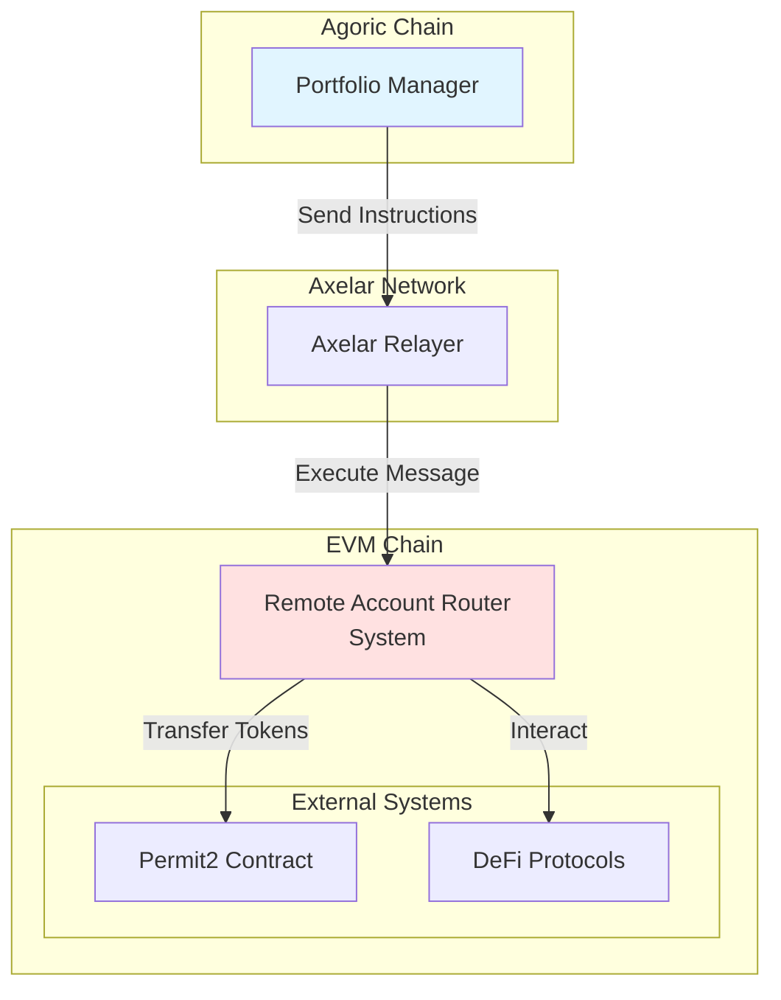
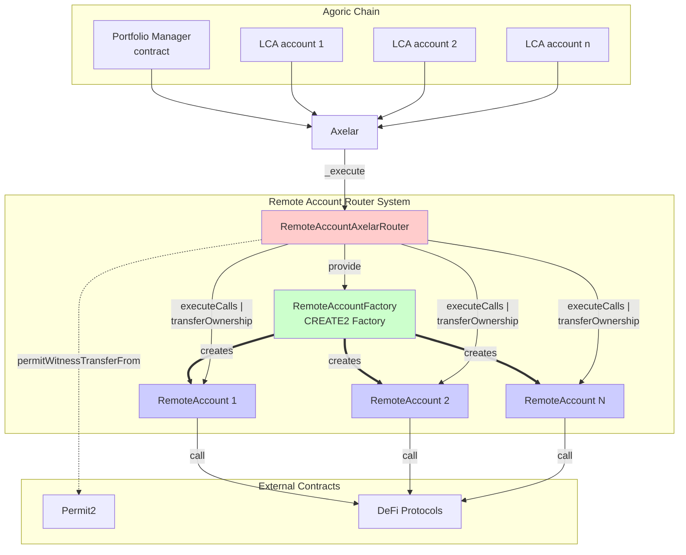
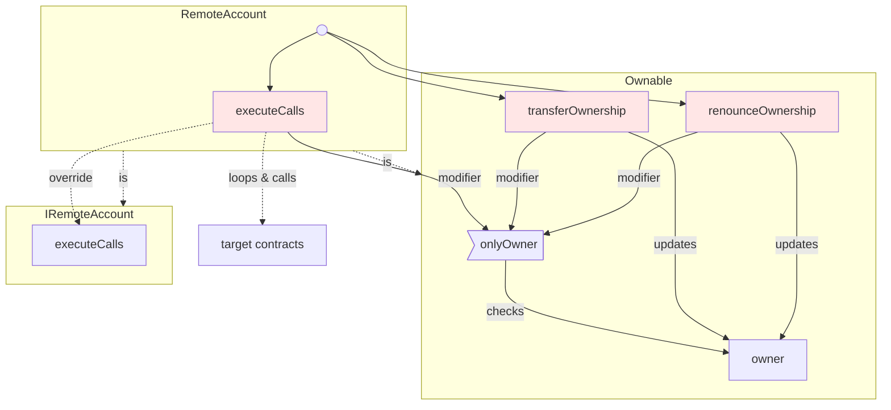
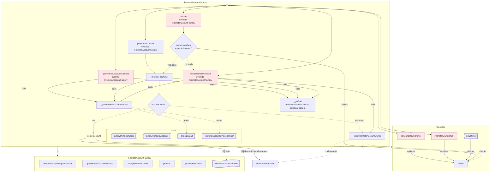
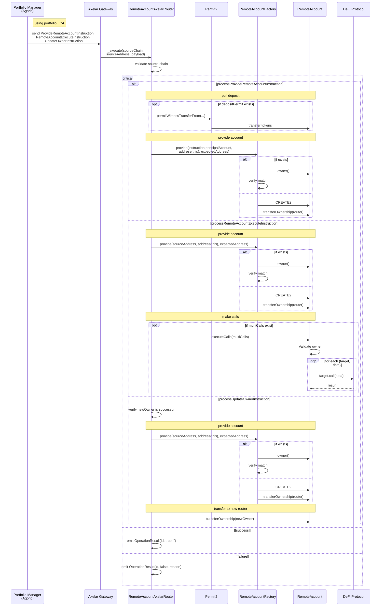
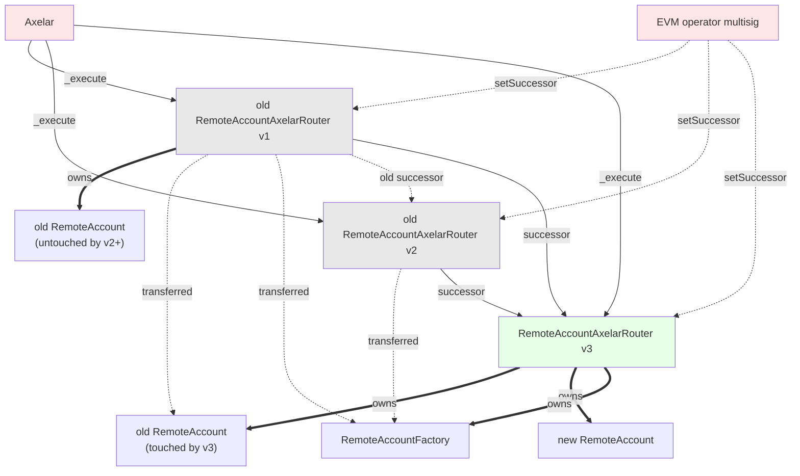
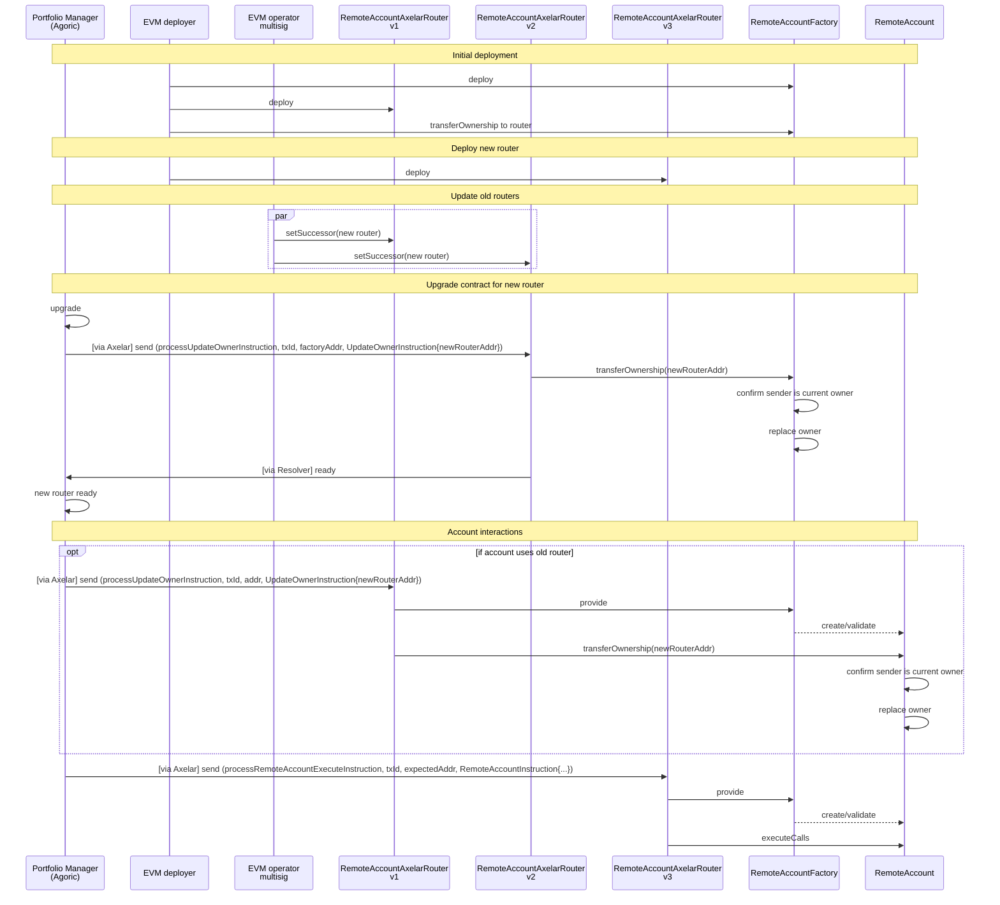

# Remote Account Router System - Design Documentation

This document provides C4-style architectural diagrams documenting the Solidity smart contracts that enable cross-chain portfolio management through [Axelar General Message Passing (GMP)](https://docs.axelar.dev/dev/general-message-passing/overview/).

## System Overview

The system enables remote account management where a portfolio manager on an Agoric chain can control accounts and executes operations on EVM chains through GMP.

## C4 Level 1: System Context Diagram

**Context**: The Remote Account Router System acts as a trusted intermediary that receives cross-chain messages from a portfolio manager on Agoric and directs operation of accounts on the EVM chain.

## C4 Level 2: Container Diagram - Data Plane Operations

**Containers**:
- **RemoteAccountAxelarRouter**: Entry point receiving messages from Axelar
- **RemoteAccountFactory**: CREATE2 factory deploying RemoteAccount contracts at deterministic addresses
- **RemoteAccount**: Individual wallet contracts acting on behalf of external principals (each one an Agoric local chain account [LCA]), executing DeFi operations

## C4 Level 3: Component Diagram - RemoteAccountAxelarRouter

```mermaid
graph TB
    subgraph AxelarExecutable
        AxelarExecutable__execute["_execute<br>(message handler)"]
    end
    subgraph ImmutableOwnable
        %% modifiers
        onlyOwner@{shape: odd}
        %% state
        owner@{shape: stored-data, label: "owner: address"}
    end
    subgraph IRemoteAccountRouter
        IRemoteAccountRouter_factory["factory(): IRemoteAccountFactory"]
        IRemoteAccountRouter_permit2["permit2(): IPermit2"]
        IRemoteAccountRouter_processProvideRemoteAccountInstruction[processProvideRemoteAccountInstruction]
        IRemoteAccountRouter_processRemoteAccountExecuteInstruction[processRemoteAccountExecuteInstruction]
        IRemoteAccountRouter_processUpdateOwnerInstruction[processUpdateOwnerInstruction]
        subgraph IRemoteAccountRouter_state[state]
            successor["successor(): address"]
        end
        %% events
        OperationResult@{shape: flag}
    end
    
    subgraph RemoteAccountAxelarRouter
        START@{shape: start}
        _execute["_execute<br/>override AxelarExecutable"]
        VALIDATE@{shape: text, label: "Axelar inbound validation"}
        DECODE{decode and select}
        processProvideRemoteAccountInstruction["processProvideRemoteAccountInstruction<br>override IRemoteAccountRouter"]
        processProvideRemoteAccountInstruction_self@{shape: comment, label: "require self-call"}
        processRemoteAccountExecuteInstruction["processRemoteAccountExecuteInstruction<br>override IRemoteAccountRouter"]
        processRemoteAccountExecuteInstruction_self@{shape: comment, label: "require self-call"}
        processUpdateOwnerInstruction["processUpdateOwnerInstruction<br>override IRemoteAccountRouter"]
        processUpdateOwnerInstruction_self@{shape: comment, label: "require self-call"}
        DEP@{shape: text, label: "Permit2 Integration"}
        PROV@{shape: text, label: "account creation/<br>verification"}
        MULTI@{shape: text, label: "account use"}
        setSuccessor
        subgraph state
            factory@{shape: stored-data, label: "factory: IRemoteAccountFactory<br>override IRemoteAccountRouter"}
            permit2@{shape: stored-data, label: "permit2: IPermit2<br>override IRemoteAccountRouter"}
            axelarSourceChainHash@{shape: stored-data, label: "axelarSourceChainHash: bytes32"}
            successor@{shape: stored-data, label: "successor: address"}
        end
    end
    
    RAn[RemoteAccount N]

    %% inheritance
    RemoteAccountAxelarRouter -.->|is| AxelarExecutable
    RemoteAccountAxelarRouter -.->|is| IRemoteAccountRouter
    RemoteAccountAxelarRouter -.->|is| ImmutableOwnable
    
    %% operation
    START --> _execute
    START --> setSuccessor
    _execute -->|"[1]"| VALIDATE
    _execute -->|"[2]"| DECODE
    DECODE -.-> processProvideRemoteAccountInstruction
    DECODE -.-> processRemoteAccountExecuteInstruction
    DECODE -.-> processUpdateOwnerInstruction
    processProvideRemoteAccountInstruction --> processProvideRemoteAccountInstruction_self
    processProvideRemoteAccountInstruction -.->|"[1] effect deposit"| DEP
    processProvideRemoteAccountInstruction -->|"[2] provide account"| PROV
    processRemoteAccountExecuteInstruction -->|"[1] provide account"| PROV
    processRemoteAccountExecuteInstruction --> processRemoteAccountExecuteInstruction_self
    processRemoteAccountExecuteInstruction -->|"[2] send calls"| MULTI
    _execute -->|"[3] emit"| OperationResult
    
    %% state/dependency access
    VALIDATE -->|checks| axelarSourceChainHash
    DEP -->|call<br>permitWitnessTransferFrom| permit2
    PROV -->|call provide| factory
    MULTI --> |call executeCalls| RAn
    processUpdateOwnerInstruction --> processUpdateOwnerInstruction_self
    processUpdateOwnerInstruction -->|"[1] checks"| successor
    processUpdateOwnerInstruction -->|"[2] call provide"| factory
    processUpdateOwnerInstruction -->|"[3] call transferOwnership"| RAn
    setSuccessor -->|updates| successor
    setSuccessor -->|modifier| onlyOwner
    onlyOwner -->|checks| owner
    
    style _execute fill:#ffe6e6
    style setSuccessor fill:#ffe6e6
    style processProvideRemoteAccountInstruction fill:#fff0e6
    style processRemoteAccountExecuteInstruction fill:#fff0e6
    style processUpdateOwnerInstruction fill:#fff0e6
    style RAn fill:#ccccff
```

**Key Components**:
- **_execute**: Validates source chain, decodes the RouterInstruction selector + payload
- **processProvideRemoteAccountInstruction**: Atomically redeems an optional deposit permit and provisions/verifies a RemoteAccount via the factory
- **processRemoteAccountExecuteInstruction**: Atomically provisions/verifies a RemoteAccount and executes its multicall batch
- **processUpdateOwnerInstruction**: Transfers factory or remote account ownership to a new router
- **Permit2 Integration**: Transfers tokens to RemoteAccount via Permit2 signature-based transfers
- **account creation/verification**: Creates or verifies RemoteAccount via factory
- **account use**: Instructs RemoteAccount to execute arbitrary multicalls
- **setSuccessor**: Enables ownership transfer to new router versions

----
## C4 Level 3: Component Diagram - RemoteAccount

**Key Components**:
- **executeCalls**: Validates owner, then atomically executes array of contract calls

## C4 Level 3: Component Diagram - RemoteAccountFactory

**Key Components**:
- **provide**: Public method requiring caller is current factory owner
- **provideForOwner**: Owner-only method to create or verify accounts for an arbitrary owner
- **_provideForOwner**: Core CREATE2 logic with deterministic address generation
- **verifyFactoryPrincipalAccount**: Validates the factory principal account string
- **Validation**: Multi-layer verification of existing accounts (code, principal, owner)

## Data Flow: Account creation and use

**Flow Description**:
1. Portfolio Manager sends instructions from portfolio LCA via Axelar GMP
2. RemoteAccountAxelarRouter validates message source
3. RemoteAccountAxelarRouter parses and processes input
     * For `processProvideRemoteAccountInstruction`:
         1. If requested, RemoteAccountAxelarRouter transfers tokens via Permit2
         2. RemoteAccountAxelarRouter provides account (creating if necessary)
     * For `processRemoteAccountExecuteInstruction`:
         1. RemoteAccountAxelarRouter provides account (creating if necessary)
         2. If calls for RemoteAccount exist, RemoteAccountAxelarRouter forwards them and RemoteAccount executes them
     * For `processUpdateOwnerInstruction`:
         1. RemoteAccountAxelarRouter verifies that the new owner identifies its successor
         2. RemoteAccountAxelarRouter provides account (creating if necessary)
         3. RemoteAccountAxelarRouter transfers account ownership
4. RemoteAccountAxelarRouter emits an event describing success or failure

## Ownership and Security Model

**Ownership**:
- Current RemoteAccountAxelarRouter owns RemoteAccountFactory and all new accounts
- Ownership of old accounts is transferred upon activity (`transferOwnership` call through old router)

**Security Checks**:
- **RemoteAccountAxelarRouter `setSuccessor`**: Validate `msg.sender` against immutable `owner`
- **RemoteAccountAxelarRouter `_execute`**: Validate `sourceChain` against immutable hash
- **RemoteAccountAxelarRouter `processProvideRemoteAccountInstruction`**: Validate the source address as the factory principal. This ensures only the portfolio manager can redeem signed permit2 intents.
- **RemoteAccountFactory `provide`**: For account creation, validate requested owner against its own owner. Validates remote account address derives from sourceAddress.
- **RemoteAccountFactory/RemoteAccount `executeCalls` and `transferOwnership`**: Validate that sender is current owner

## Deployment

**Migration Features**:
- Non-disruptive: Can migrate one account at a time
- Safe: Requires both owner of old router and portfolio manager agreement
- Flexible: RemoteAccount addresses remain constant
- Auditable: All account changes performed via cross-chain messages.
