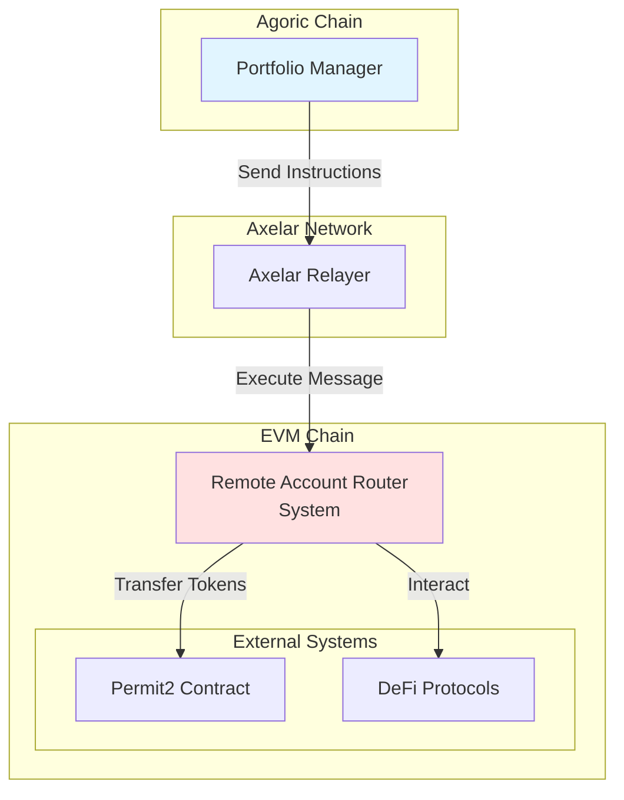
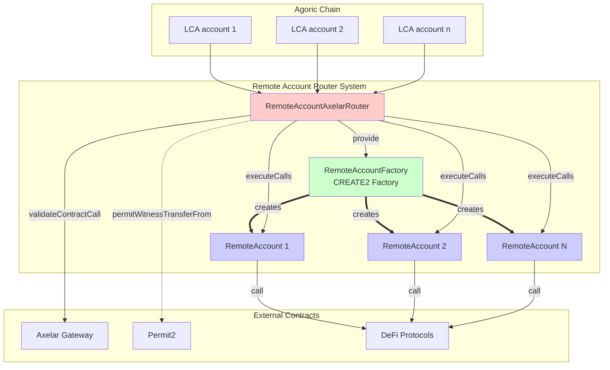
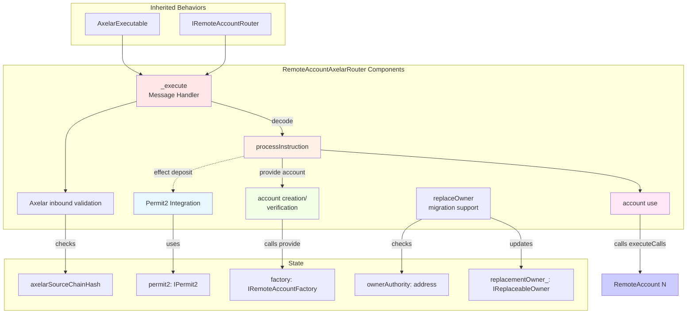
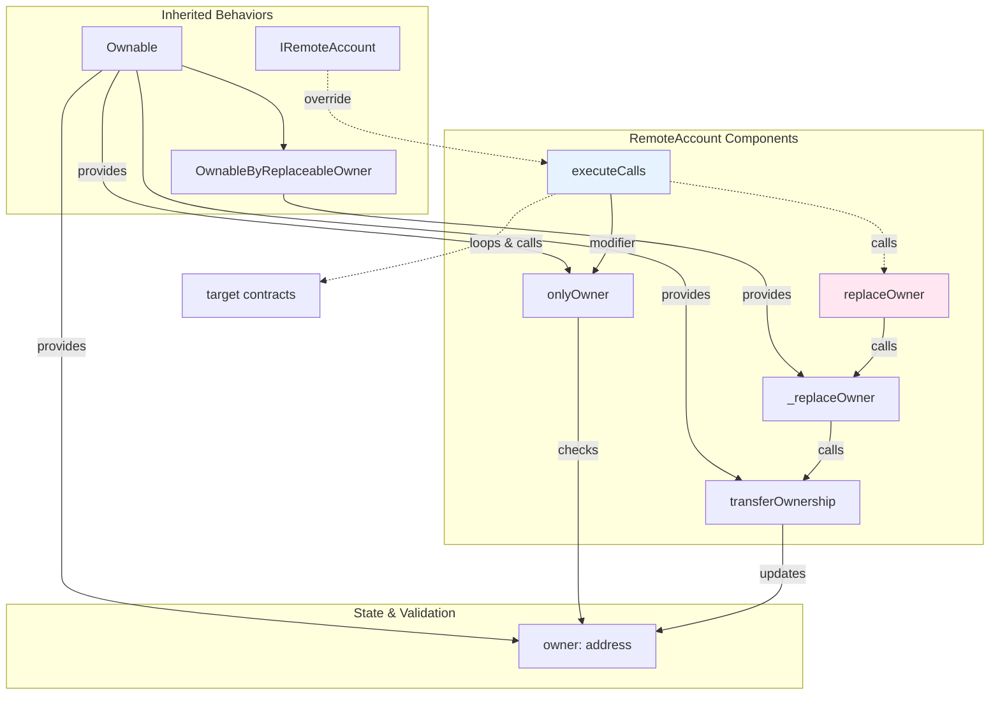
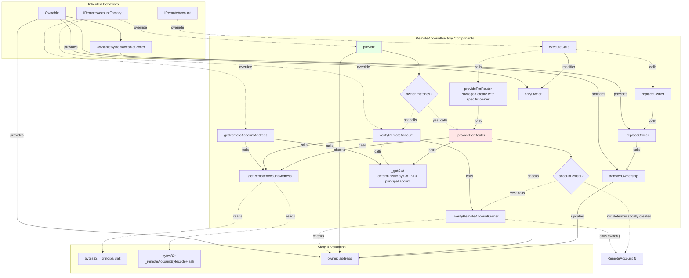
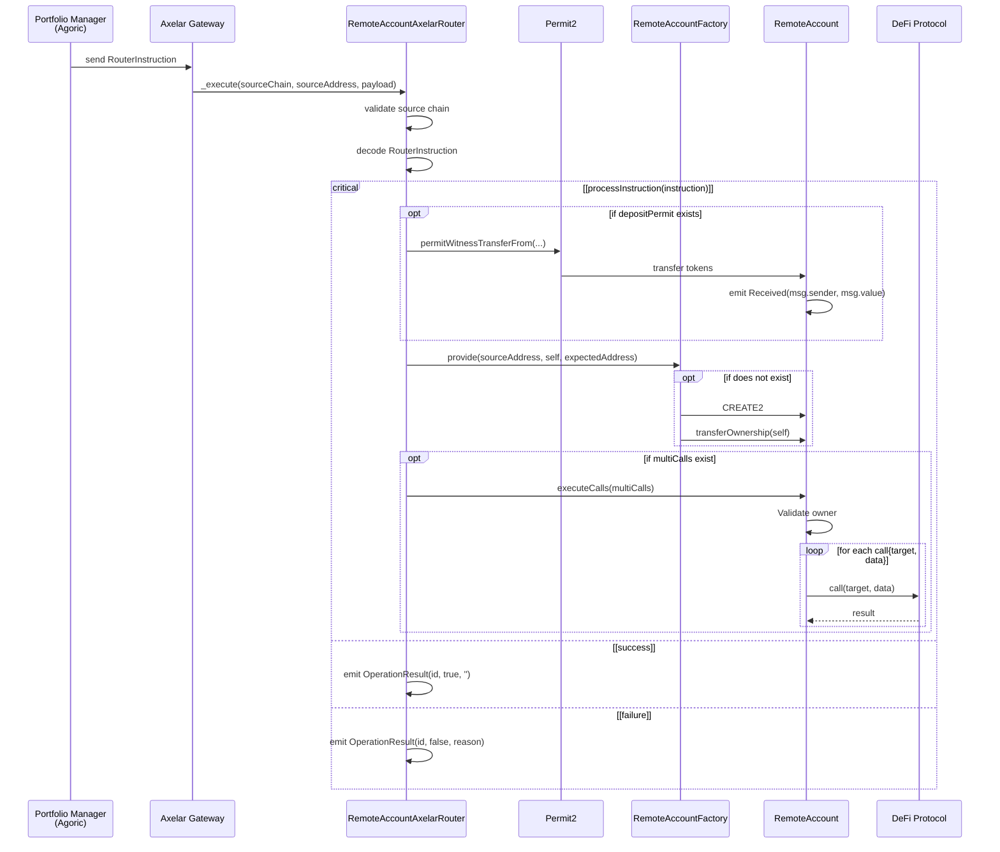
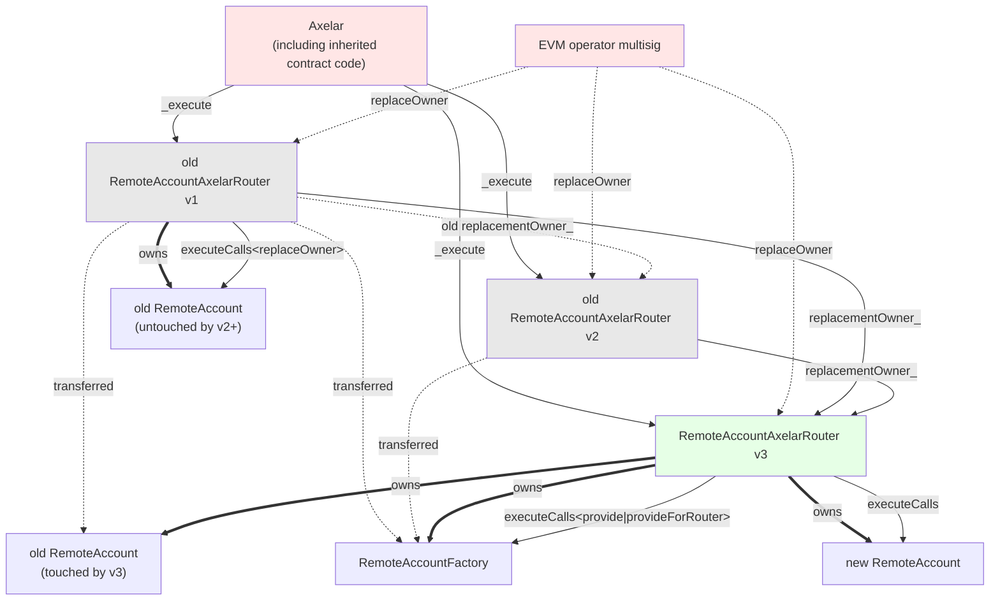
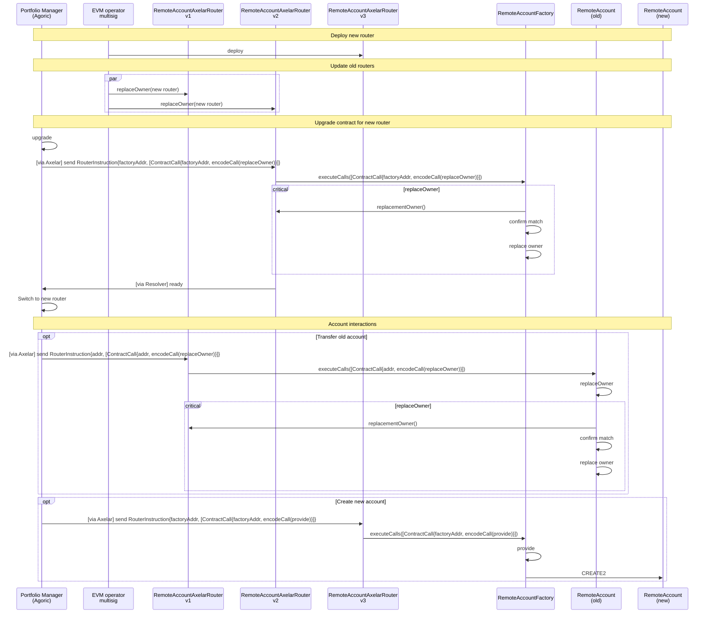

# Remote Account Router System - Design Documentation

This document provides C4-style architectural diagrams documenting the Solidity smart contracts that enable cross-chain portfolio management through [Axelar General Message Passing (GMP)](https://docs.axelar.dev/dev/general-message-passing/overview/).

## System Overview

The system enables remote account management where a portfolio manager on an Agoric chain can control accounts and executes operations on EVM chains through GMP.

## C4 Level 1: System Context Diagram

**Context**: The Remote Account Router System acts as a trusted intermediary that receives cross-chain messages from a portfolio manager on Agoric and directs operation of accounts on the EVM chain.

## C4 Level 2: Container Diagram - Data Plane Operations

**Containers**:
- **RemoteAccountAxelarRouter**: Entry point receiving messages from Axelar
- **RemoteAccountFactory**: CREATE2 factory deploying RemoteAccount contracts at deterministic addresses
- **RemoteAccount**: Individual wallet contracts acting on behalf of external principals (each one an Agoric local chain account [LCA]), executing DeFi operations

## C4 Level 3: Component Diagram - RemoteAccountAxelarRouter

**Key Components**:
- **_execute**: Validates source chain, decodes RouterInstruction
- **processInstruction**: Atomically handles (depositPermit?, multiCalls) input, automatically performing account provisioning/verification
- **Permit2 Integration**: Transfers tokens to RemoteAccount via Permit2 signature-based transfers
- **account creation/verification**: Creates or verifies RemoteAccount via factory
- **account use**: Instructs RemoteAccount to execute arbitrary multicalls
- **replaceOwner**: Enables ownership transfer to new router versions

----
## C4 Level 3: Component Diagram - RemoteAccount

**Key Components**:
- **executeCalls**: Validates owner, then atomically executes array of contract calls
- **replaceOwner**: Enables migration by transferring to designated replacement owner

## C4 Level 3: Component Diagram - RemoteAccountFactory

**Key Components**:
- **provide**: Public method requiring caller is current factory owner
- **provideForRouter**: Self-call method allowing arbitrary router specification
- **_provideForRouter**: Core CREATE2 logic with deterministic address generation
- **Validation**: Multi-layer verification of existing accounts (code, principal, owner)

## Data Flow: Account creation and use

**Flow Description**:
1. Portfolio Manager sends instructions via Axelar GMP
2. RemoteAccountAxelarRouter validates message source
3. If requested, RemoteAccountAxelarRouter transfers tokens via Permit2
4. RemoteAccountAxelarRouter provides account (creating if necessary)
5. If calls for RemoteAccount exist, RemoteAccountAxelarRouter sends them and RemoteAccount executes them
6. RemoteAccountAxelarRouter emits an event describing success or failure

# FIXME: The remainder has not yet been edited

## Ownership and Security Model

**Ownership**:
- Current RemoteAccountAxelarRouter owns RemoteAccountFactory and all new accounts
- Ownership of old accounts is transferred upon activity (old router calls `replaceOwner`)

**Security Checks**:
- **RemoteAccountAxelarRouter `replaceOwner`**: Validate `msg.sender` against immutable `ownerAuthority`
- **RemoteAccountAxelarRouter `_execute`**: Validate sourceChain against immutable hash
- **RemoteAccountFactory `provide`**: For account creation, validate requested owner against its own owner
- **RemoteAccountFactory `provideForRouter`**: Validate self-call (from `executeCalls`)
- **RemoteAccountFactory/RemoteAccount `executeCalls`**: Validate that sender is current owner
- **RemoteAccountFactory/RemoteAccount `replaceOwner`**: Validate self-call (from `executeCalls`) and (via OwnableByReplaceableOwner inheritance) that the old owner confirms the requested new owner

**Security Layers**:
1. **Axelar Validation**: Only messages from specific chain and address accepted
2. **Principal Validation**: RemoteAccount verifies CAIP-10 identity of controller
3. **Ownership**: Router owns all RemoteAccounts and Factory
4. **Replaceability**: Migration path via designated replacement owner

## Deployment

**Migration Features**:
- Non-disruptive: Can migrate one account at a time
- Safe: Requires both old and new router agreement
- Flexible: RemoteAccount addresses remain constant
- Auditable: All transfers via on-chain multicalls
