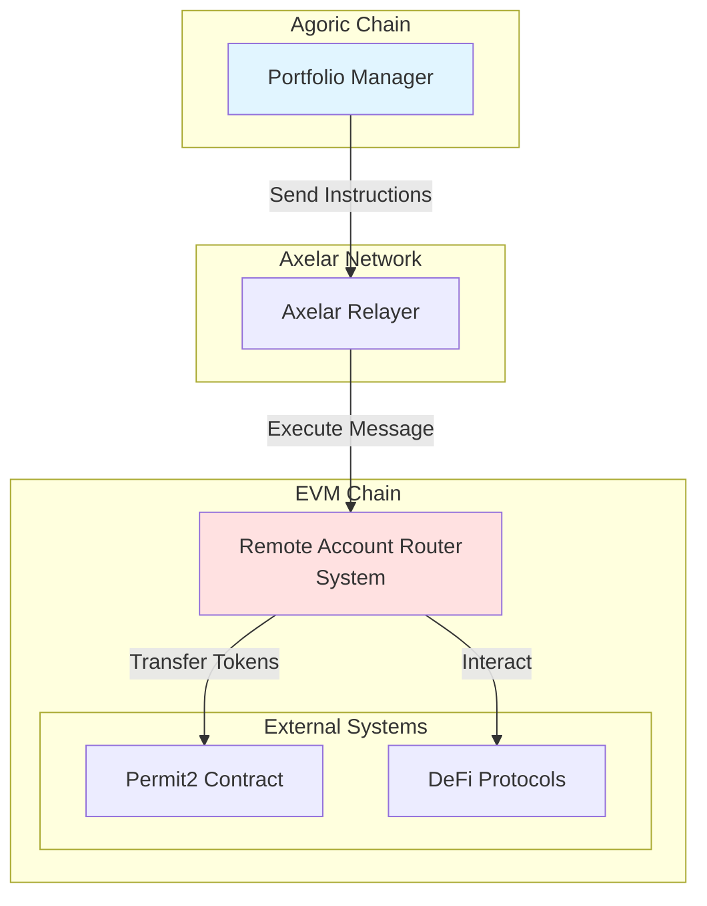
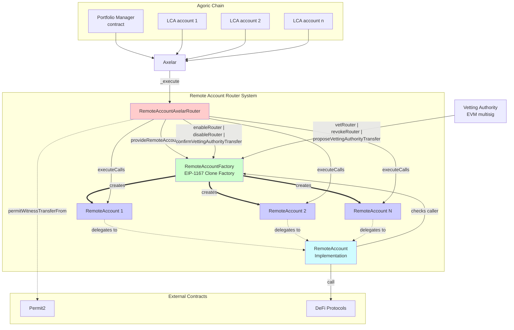
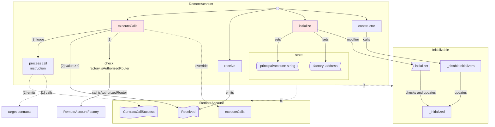
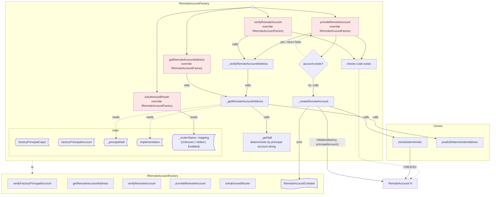
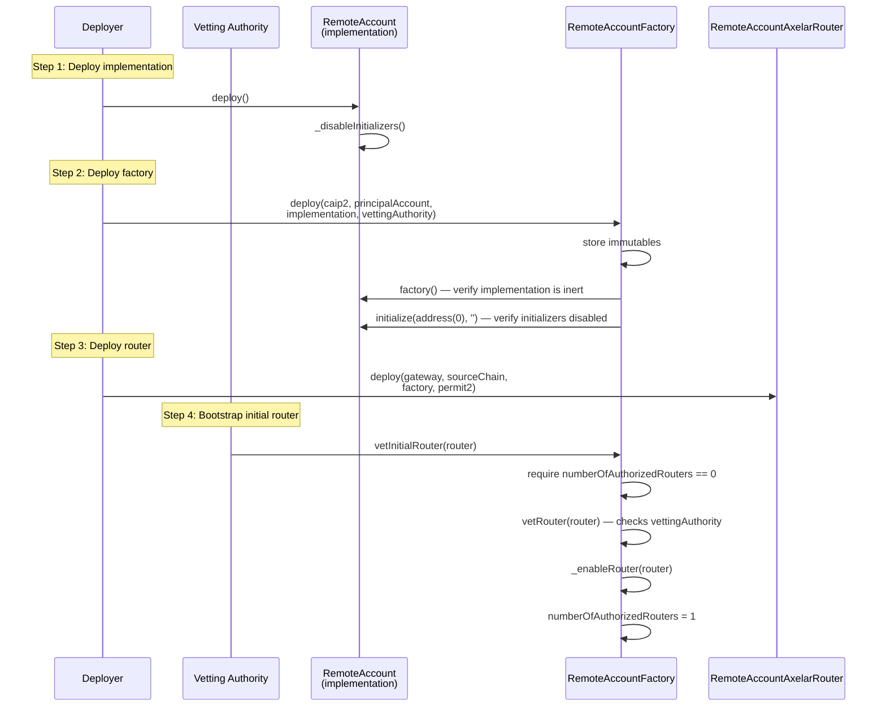
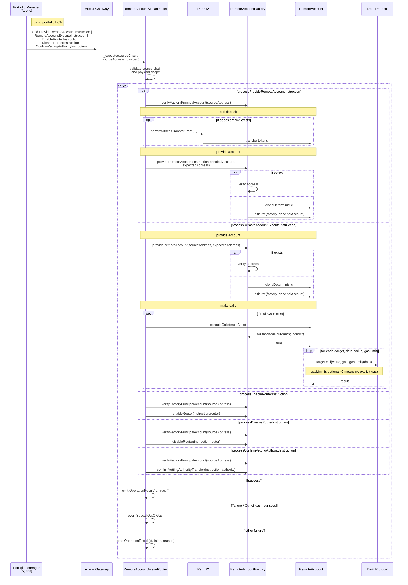
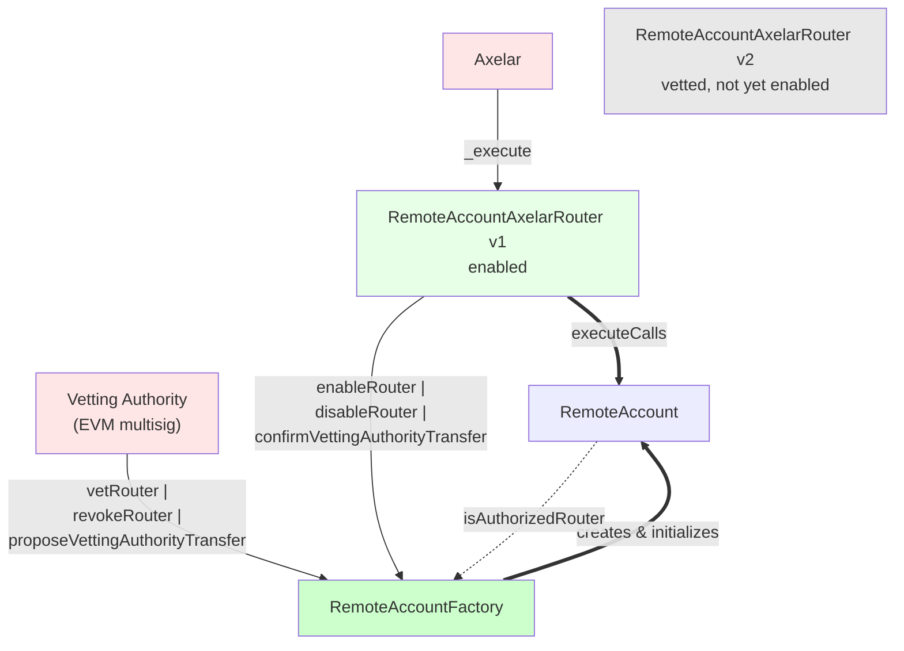
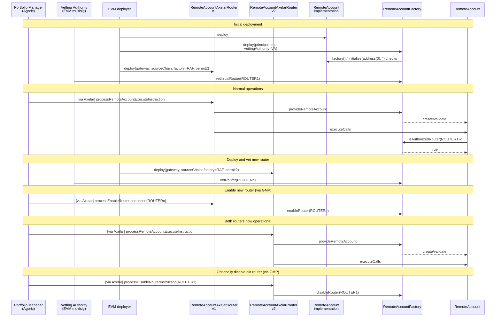

# Remote Account Router System - Design Documentation

This document provides C4-style architectural diagrams documenting the Solidity smart contracts that enable cross-chain portfolio management through [Axelar General Message Passing (GMP)](https://docs.axelar.dev/dev/general-message-passing/overview/).

## System Overview

The system enables remote account management where a portfolio manager on an Agoric chain can control accounts and executes operations on EVM chains through GMP.

## C4 Level 1: System Context Diagram

```mermaid
graph TB
    subgraph "Agoric Chain"
        PM[Portfolio Manager]
    end

    subgraph "Axelar Network"
        EX[Axelar Relayer]
    end

    subgraph "EVM Chain"
        PRS[Remote Account Router<br>System]

        subgraph "External Systems"
            P2[Permit2 Contract]
            DEFI[DeFi Protocols]
        end
    end

    PM -->|Send Instructions| EX
    EX -->|Execute Message| PRS
    PRS -->|Transfer Tokens| P2
    PRS -->|Interact| DEFI

    style PM fill:#e1f5ff
    style PRS fill:#ffe1e1
```

**Context**: The Remote Account Router System acts as a trusted intermediary that receives cross-chain messages from a portfolio manager on Agoric and directs operation of accounts on the EVM chain.

## C4 Level 2: Container Diagram - Data Plane Operations

```mermaid
graph TB
    subgraph "Agoric Chain"
        YMAX[Portfolio Manager<br>contract]
        LCA1[LCA account 1]
        LCA2[LCA account 2]
        LCAn[LCA account n]
    end

    AXL[Axelar]

    subgraph "Remote Account Router System"
        PR[RemoteAccountAxelarRouter]
        RAF[RemoteAccountFactory<br/>EIP-1167 Clone Factory]
        IMP[RemoteAccount<br/>Implementation]
        RA1[RemoteAccount 1]
        RA2[RemoteAccount 2]
        RAn[RemoteAccount N]
    end

    subgraph "External Contracts"
        P2[Permit2]
        PROTO[DeFi Protocols]
    end

    VA[Vetting Authority<br/>EVM multisig]

    YMAX --> AXL
    LCA1 --> AXL
    LCA2 --> AXL
    LCAn --> AXL
    AXL -->|_execute| PR
    PR -->|provideRemoteAccount| RAF
    PR -->|"enableRouter |<br>disableRouter |<br>confirmVettingAuthorityTransfer"| RAF
    RAF ==>|creates| RA1
    RAF ==>|creates| RA2
    RAF ==>|creates| RAn
    RA1 -.->|delegates to| IMP
    RA2 -.->|delegates to| IMP
    RAn -.->|delegates to| IMP
    PR -->|executeCalls| RA1
    PR -->|executeCalls| RA2
    PR -->|executeCalls| RAn
    PR -.->|permitWitnessTransferFrom| P2
    VA -->|"vetRouter |<br>revokeRouter |<br>proposeVettingAuthorityTransfer"| RAF
    IMP -->|checks caller| RAF
    IMP -->|call| PROTO

    style PR fill:#ffcccc
    style RAF fill:#ccffcc
    style IMP fill:#cffcff
    style RA1 fill:#ccccff
    style RA2 fill:#ccccff
    style RAn fill:#ccccff
```

**Containers**:

- **RemoteAccountAxelarRouter**: Entry point receiving messages from Axelar
- **RemoteAccountFactory**: EIP-1167 clone factory deploying deterministic proxy instances via `cloneDeterministic`
- **RemoteAccount implementation**: Shared logic contract used by all clone instances
- **RemoteAccount**: Individual wallet contracts acting on behalf of external principals (each one an Agoric local chain account [LCA]), executing DeFi operations

## C4 Level 3: Component Diagram - RemoteAccountAxelarRouter

```mermaid
graph TB
    subgraph AxelarExecutable
        AxelarExecutable__execute["_execute<br>(message handler)"]
    end
    subgraph IRemoteAccountRouter
        IRemoteAccountRouter_factory["factory(): IRemoteAccountFactory"]
        IRemoteAccountRouter_permit2["permit2(): IPermit2"]
        IRemoteAccountRouter_processProvideRemoteAccountInstruction[processProvideRemoteAccountInstruction]
        IRemoteAccountRouter_processRemoteAccountExecuteInstruction[processRemoteAccountExecuteInstruction]
        IRemoteAccountRouter_adminInstructions["processEnableRouterInstruction<br>processDisableRouterInstruction<br>processConfirmVettingAuthorityInstruction"]
        %% events
        OperationResult@{shape: flag}
    end

    subgraph RemoteAccountAxelarRouter
        START@{shape: start}
        _execute["_execute<br/>override AxelarExecutable"]
        VALIDATE@{shape: text, label: "validate source and<br>decoded payload"}
        DISPATCH@{shape: text, label: "self-call instruction<br>processor"}
        OOG@{shape: text, label: "revert<br>SubcallOutOfGas()"}
        processProvideRemoteAccountInstruction["processProvideRemoteAccountInstruction<br>override IRemoteAccountRouter"]
        processProvideRemoteAccountInstruction_self@{shape: comment, label: "require self-call"}
        processRemoteAccountExecuteInstruction["processRemoteAccountExecuteInstruction<br>override IRemoteAccountRouter"]
        processRemoteAccountExecuteInstruction_self@{shape: comment, label: "require self-call"}
        adminInstructions["processEnableRouterInstruction |<br>processDisableRouterInstruction |<br>processConfirmVettingAuthorityInstruction"]
        adminInstructions_self@{shape: comment, label: "require self-call"}
        VERIFY_FACTORY@{shape: text, label: "verify factory address<br>and principal"}
        DEP@{shape: text, label: "Permit2 Integration"}
        PROV@{shape: text, label: "account creation/<br>verification"}
        MULTI@{shape: text, label: "account use"}
        ADMIN_CALL@{shape: text, label: "factory admin call<br>(enableRouter |<br>disableRouter |<br>confirmVettingAuthorityTransfer)"}
        subgraph state
            factory@{shape: stored-data, label: "factory: IRemoteAccountFactory<br>override IRemoteAccountRouter"}
            permit2@{shape: stored-data, label: "permit2: IPermit2<br>override IRemoteAccountRouter"}
            axelarSourceChain@{shape: stored-data, label: "axelarSourceChain: string"}
            axelarSourceChainHash@{shape: stored-data, label: "axelarSourceChainHash: bytes32"}
        end
    end

    RAn[RemoteAccount N]

    %% inheritance
    RemoteAccountAxelarRouter -.->|is| AxelarExecutable
    RemoteAccountAxelarRouter -.->|is| IRemoteAccountRouter

    %% operation
    START --> _execute
    _execute -->|"[1]"| VALIDATE
    _execute -->|"[2]"| DISPATCH
    _execute -->|"[3] gas heuristics"| OOG
    DISPATCH -.-> processProvideRemoteAccountInstruction
    DISPATCH -.-> processRemoteAccountExecuteInstruction
    DISPATCH -.-> adminInstructions
    processProvideRemoteAccountInstruction --> processProvideRemoteAccountInstruction_self
    processProvideRemoteAccountInstruction -->|"[1]"| VERIFY_FACTORY
    processProvideRemoteAccountInstruction -.->|"[2] effect deposit"| DEP
    processProvideRemoteAccountInstruction -->|"[3] provide account"| PROV
    processRemoteAccountExecuteInstruction --> processRemoteAccountExecuteInstruction_self
    processRemoteAccountExecuteInstruction -->|"[1] provide account"| PROV
    processRemoteAccountExecuteInstruction -->|"[2] send calls"| MULTI
    adminInstructions --> adminInstructions_self
    adminInstructions -->|"[1]"| VERIFY_FACTORY
    adminInstructions -->|"[2]"| ADMIN_CALL
    _execute -->|"[4] else emit"| OperationResult

    %% state/dependency access
    VALIDATE -->|checks| axelarSourceChainHash
    DEP -->|call<br>permitWitnessTransferFrom| permit2
    VERIFY_FACTORY -->|call verifyFactoryPrincipalAccount| factory
    PROV -->|call provideRemoteAccount| factory
    MULTI --> |call executeCalls| RAn
    ADMIN_CALL -->|call| factory

    style _execute fill:#ffe6e6
    style processProvideRemoteAccountInstruction fill:#fff0e6
    style processRemoteAccountExecuteInstruction fill:#fff0e6
    style adminInstructions fill:#fff0e6
    style RAn fill:#ccccff
```

**Key Components**:

- **\_execute**: Validates source chain, selector, and common decoded payload arguments before dispatching
- **processProvideRemoteAccountInstruction**: Atomically redeems an optional deposit permit and provisions/verifies a RemoteAccount via the factory
- **processRemoteAccountExecuteInstruction**: Atomically provisions/verifies a RemoteAccount and executes its multicall batch
- **processEnableRouterInstruction / processDisableRouterInstruction / processConfirmVettingAuthorityInstruction**: Admin instructions that verify the factory principal, then call the corresponding factory method
- **Permit2 Integration**: Transfers tokens to RemoteAccount via Permit2 signature-based transfers
- **account creation/verification**: Creates or verifies RemoteAccount via factory
- **account use**: Instructs RemoteAccount to execute arbitrary multicalls
- **OperationResult / SubcallOutOfGas**: Processor-level success and failure produce `OperationResult`; selected out-of-gas cases revert with `SubcallOutOfGas`

---

## C4 Level 3: Component Diagram - RemoteAccount

```mermaid
graph TB
    subgraph Initializable
        _initialized
        _disableInitializers
        %% modifiers
        initializer@{shape: odd}
    end
    subgraph IRemoteAccount
        IRemoteAccount_executeCalls[executeCalls]
        %% events
        Received@{shape: flag}
        ContractCallSuccess@{shape: flag}
    end

    subgraph RemoteAccount
        START@{shape: start}
        CTOR[constructor]
        initialize
        receive
        executeCalls
        AUTH_CHECK@{shape: text, label: "check factory.isAuthorizedRouter"}
        CALL["process call<br>instruction"]
        subgraph state
            factory_ref@{shape: stored-data, label: "factory: address"}
            principalAccount_ref@{shape: stored-data, label: "principalAccount: string"}
        end
    end

    EXTERNAL[target contracts]
    FACTORY[RemoteAccountFactory]

    %% inheritance
    RemoteAccount -.->|is| Initializable
    RemoteAccount -.->|is| IRemoteAccount
    executeCalls -.->|override| IRemoteAccount_executeCalls

    %% operation
    START --> CTOR
    START --> initialize
    START --> receive
    START --> executeCalls
    CTOR -->|calls| _disableInitializers
    initialize -->|modifier| initializer
    initialize -->|sets| factory_ref
    initialize -->|sets| principalAccount_ref
    executeCalls -->|"[1]"| AUTH_CHECK
    executeCalls -->|"[2] value > 0"| Received
    executeCalls -->|"[3] loops"| CALL
    CALL -.->|"[1] calls"| EXTERNAL
    CALL -.->|"[2] emits"| ContractCallSuccess
    receive -->|"emits"| Received

    %% state/dependency access
    AUTH_CHECK -->|call isAuthorizedRouter| FACTORY
    initializer -->|checks and updates| _initialized
    _disableInitializers -->|updates| _initialized

    style executeCalls fill:#ffe6e6
    style initialize fill:#ffe6e6
```

**Key Components**:

- **initialize**: One-time factory and `principalAccount` initialization for clone instances
- **receive**: Accepts native token transfers and emits `Received`
- **executeCalls**: Checks authorization via `factory.isAuthorizedRouter(msg.sender)`, then atomically executes array of contract calls with per-call reporting

## C4 Level 3: Component Diagrams - RemoteAccountFactory

### Remote Account Operations

```mermaid
graph TB
    subgraph Clones
        cloneDeterministic
        predictDeterministicAddress
    end
    subgraph IRemoteAccountFactory
        IRemoteAccountFactory_verifyFactoryPrincipalAccount[verifyFactoryPrincipalAccount]
        IRemoteAccountFactory_getRemoteAccountAddress[getRemoteAccountAddress]
        IRemoteAccountFactory_verifyRemoteAccount[verifyRemoteAccount]
        IRemoteAccountFactory_provideRemoteAccount[provideRemoteAccount]
        IRemoteAccountFactory_isAuthorizedRouter[isAuthorizedRouter]
        %% events
        RemoteAccountCreated@{shape: flag}
    end

    subgraph RemoteAccountFactory
        START@{shape: start}
        getRemoteAccountAddress["getRemoteAccountAddress<br>override IRemoteAccountFactory"]
        _getRemoteAccountAddress

        verifyRemoteAccount["verifyRemoteAccount<br>override IRemoteAccountFactory"]
        _verifyRemoteAccountAddress

        provideRemoteAccount["provideRemoteAccount<br>override IRemoteAccountFactory"]
        _createRemoteAccount
        ACCOUNT_EXISTS{account exists?}

        isAuthorizedRouter["isAuthorizedRouter<br>override IRemoteAccountFactory"]

        CODE_EXISTS["checks code exists"]
        _getSalt[_getSalt<br>deterministic by principal account string]
        subgraph state
            factoryPrincipalCaip2@{shape: stored-data}
            factoryPrincipalAccount@{shape: stored-data}
            _principalSalt@{shape: stored-data}
            implementation@{shape: stored-data}
            _routerStatus@{shape: stored-data, label: "_routerStatus: mapping<br>(Unknown | Vetted | Enabled)"}
        end
    end

    RAn[RemoteAccount N]

    %% inheritance
    RemoteAccountFactory -.->|is| IRemoteAccountFactory

    %% operation
    START --> provideRemoteAccount
    START --> verifyRemoteAccount
    START --> getRemoteAccountAddress
    START --> isAuthorizedRouter

    provideRemoteAccount --> _verifyRemoteAccountAddress
    provideRemoteAccount --> CODE_EXISTS
    provideRemoteAccount --> ACCOUNT_EXISTS
    ACCOUNT_EXISTS -.->|yes: return false| provideRemoteAccount
    ACCOUNT_EXISTS -->|no: calls| _createRemoteAccount

    verifyRemoteAccount -->|calls| _verifyRemoteAccountAddress
    verifyRemoteAccount --> CODE_EXISTS

    _verifyRemoteAccountAddress -->|calls| _getRemoteAccountAddress
    _getRemoteAccountAddress -->|calls| _getSalt
    _getRemoteAccountAddress -->|calls| predictDeterministicAddress

    CODE_EXISTS -.-> RAn

    _createRemoteAccount -->|calls| cloneDeterministic
    cloneDeterministic -->|"CREATE2"| RAn
    _createRemoteAccount -->|"initialize(factory, principalAccount)"| RAn
    _createRemoteAccount -->|"emit"| RemoteAccountCreated

    getRemoteAccountAddress -->|calls| _getRemoteAccountAddress

    isAuthorizedRouter -->|reads| _routerStatus

    %% state access
    _getRemoteAccountAddress -.->|reads| _principalSalt
    _getRemoteAccountAddress -.->|reads| implementation

    style provideRemoteAccount fill:#ffe6e6
    style verifyRemoteAccount fill:#ffe6e6
    style getRemoteAccountAddress fill:#ffe6e6
    style isAuthorizedRouter fill:#ffe6e6
```

### Router & Vetting Authority Administration

```mermaid
graph TB
    subgraph IRemoteAccountFactory
        IRemoteAccountFactory_isAuthorizedRouter[isAuthorizedRouter]
        IRemoteAccountFactory_enableRouter[enableRouter]
        IRemoteAccountFactory_disableRouter[disableRouter]
        IRemoteAccountFactory_confirmVettingAuthorityTransfer[confirmVettingAuthorityTransfer]
        %% events
        RouterVetted@{shape: flag}
        RouterEnabled@{shape: flag}
        RouterDisabled@{shape: flag}
        RouterRevoked@{shape: flag}
        VettingAuthorityTransferProposed@{shape: flag}
        VettingAuthorityTransferred@{shape: flag}
    end

    subgraph RemoteAccountFactory
        START@{shape: start}

        isAuthorizedRouter["isAuthorizedRouter<br>override IRemoteAccountFactory"]
        getRouterStatus

        subgraph "EVM-sourced (vetting authority)"
            CHECK_VA@{shape: text, label: "check msg.sender ==<br>vettingAuthority"}
            vetInitialRouter
            vetRouter
            revokeRouter
            proposeVettingAuthorityTransfer
        end

        _enableRouter["_enableRouter (internal)"]

        subgraph "Agoric-sourced (enabled router)"
            CHECK_ROUTER@{shape: text, label: "check isAuthorizedRouter<br>(msg.sender)"}
            enableRouter["enableRouter<br>override IRemoteAccountFactory"]
            disableRouter["disableRouter<br>override IRemoteAccountFactory"]
            confirmVettingAuthorityTransfer["confirmVettingAuthorityTransfer<br>override IRemoteAccountFactory"]
        end

        subgraph state
            numberOfAuthorizedRouters@{shape: stored-data}
            _routerStatus@{shape: stored-data, label: "_routerStatus: mapping<br>(Unknown | Vetted | Enabled)"}
            vettingAuthority@{shape: stored-data}
            _pendingVettingAuthority@{shape: stored-data}
        end
    end

    %% inheritance
    RemoteAccountFactory -.->|is| IRemoteAccountFactory

    %% operation
    START --> isAuthorizedRouter
    START --> getRouterStatus
    START --> vetInitialRouter
    START --> vetRouter
    START --> enableRouter
    START --> disableRouter
    START --> revokeRouter
    START --> proposeVettingAuthorityTransfer
    START --> confirmVettingAuthorityTransfer

    isAuthorizedRouter -->|reads| _routerStatus
    getRouterStatus -->|reads| _routerStatus

    %% EVM-sourced operations (vetting authority)
    vetInitialRouter -->|"[1] guard"| numberOfAuthorizedRouters
    vetInitialRouter -->|"[2] calls"| vetRouter
    vetInitialRouter -->|"[3] calls"| _enableRouter

    vetRouter -->|"[1]"| CHECK_VA
    vetRouter -->|"[2] updates"| _routerStatus
    vetRouter -->|emit| RouterVetted

    revokeRouter -->|"[1]"| CHECK_VA
    revokeRouter -->|"[2] updates"| _routerStatus
    revokeRouter -->|emit| RouterRevoked

    proposeVettingAuthorityTransfer -->|"[1]"| CHECK_VA
    proposeVettingAuthorityTransfer -->|"[2] updates"| _pendingVettingAuthority
    proposeVettingAuthorityTransfer -->|emit| VettingAuthorityTransferProposed

    CHECK_VA -->|checks| vettingAuthority

    %% Agoric-sourced operations (enabled router)
    enableRouter -->|"[1]"| CHECK_ROUTER
    enableRouter -->|"[2] calls"| _enableRouter

    _enableRouter -->|"[1] updates"| _routerStatus
    _enableRouter -->|"[2] increments"| numberOfAuthorizedRouters
    _enableRouter -->|emit| RouterEnabled

    disableRouter -->|"[1]"| CHECK_ROUTER
    disableRouter -->|"[2] updates"| _routerStatus
    disableRouter -->|"[3] decrements"| numberOfAuthorizedRouters
    disableRouter -->|emit| RouterDisabled

    confirmVettingAuthorityTransfer -->|"[1]"| CHECK_ROUTER
    confirmVettingAuthorityTransfer -->|"[2] checks"| _pendingVettingAuthority
    confirmVettingAuthorityTransfer -->|"[3] updates"| vettingAuthority
    confirmVettingAuthorityTransfer -->|emit| VettingAuthorityTransferred

    CHECK_ROUTER -->|calls| isAuthorizedRouter

    style isAuthorizedRouter fill:#ffe6e6
    style vetInitialRouter fill:#ffe6e6
    style vetRouter fill:#ffe6e6
    style enableRouter fill:#ffe6e6
    style _enableRouter fill:#fff0e6
    style disableRouter fill:#ffe6e6
    style revokeRouter fill:#ffe6e6
    style proposeVettingAuthorityTransfer fill:#ffe6e6
    style confirmVettingAuthorityTransfer fill:#ffe6e6
```

**Key Components (Remote Account Operations)**:

- **provideRemoteAccount**: Creates or verifies a remote account at the expected address derived from the principal
- **verifyRemoteAccount**: Verification of existing accounts by deterministic address derivation and code existence
- **verifyFactoryPrincipalAccount**: Validates the factory principal account string
- **\_verifyRemoteAccountAddress**: Enforces principal-to-address derivation before creation/verification
- **\_getRemoteAccountAddress**: Rejects the factory principal account (prevents treating factory as a remote account)
- **\_createRemoteAccount**: Core deterministic clone deployment + factory reference initialization
- **isAuthorizedRouter**: Checks if a caller is an enabled router

**Key Components (Router & Vetting Authority Administration)**:

- **vetInitialRouter**: Vets and enables the very first router (vetting authority only, no previous router). This initializes the factory.
- **vetRouter**: Marks a router as vetted (vetting authority only)
- **enableRouter**: Enables a vetted router (enabled router only)
- **disableRouter**: Disables an enabled router (enabled router only, not self)
- **revokeRouter**: Revokes a vetted router (vetting authority only)
- **proposeVettingAuthorityTransfer**: Proposes a new vetting authority (current vetting authority only)
- **confirmVettingAuthorityTransfer**: Confirms the pending vetting authority transfer (enabled router only)

## Data Flow: Factory deployment and initial router setup

```mermaid
sequenceDiagram
    participant D as Deployer
    participant V as Vetting Authority
    participant RA_IMPL as RemoteAccount<br/>(implementation)
    participant RAF as RemoteAccountFactory
    participant R as RemoteAccountAxelarRouter

    Note over D: Step 1: Deploy implementation
    D->>RA_IMPL: deploy()
    RA_IMPL->>RA_IMPL: _disableInitializers()

    Note over D: Step 2: Deploy factory
    D->>RAF: deploy(caip2, principalAccount,<br>implementation, vettingAuthority)
    RAF->>RAF: store immutables
    RAF->>RA_IMPL: factory() — verify implementation is inert
    RAF->>RA_IMPL: initialize(address(0), '') — verify initializers disabled

    Note over D: Step 3: Deploy router
    D->>R: deploy(gateway, sourceChain,<br>factory, permit2)

    Note over V: Step 4: Bootstrap initial router
    V->>RAF: vetInitialRouter(router)
    RAF->>RAF: require numberOfAuthorizedRouters == 0
    RAF->>RAF: vetRouter(router) — checks vettingAuthority
    RAF->>RAF: _enableRouter(router)
    RAF->>RAF: numberOfAuthorizedRouters = 1
```

**Deployment Notes**:

- The factory constructor does not accept an "initial router" parameter and instead, requires an initialization step (`vetInitialRouter`) from the vetting authority. This avoids creating a circular dependency when constructing the factory and the first router.
- The vetting authority address is required at construction of the factory. This is to ensure any CREATE2 based deployments cannot be squatted.
- `vetInitialRouter` is a one-shot bootstrap: it reverts once any router has been authorized (`numberOfAuthorizedRouters > 0`). Subsequent routers follow the normal vet → enable lifecycle via GMP. It's also not possible to revert back to 0 authorized routers.

## Data Flow: Account creation and use

```mermaid
sequenceDiagram
    participant PM as Portfolio Manager<br/>(Agoric)
    participant AXL as Axelar Gateway
    participant PR as RemoteAccountAxelarRouter
    participant P2 as Permit2
    participant RAF as RemoteAccountFactory
    participant RA as RemoteAccount
    participant DEFI as DeFi Protocol

    Note right of PM: using portfolio LCA
    PM->>AXL: send ProvideRemoteAccountInstruction |<br>RemoteAccountExecuteInstruction |<br>EnableRouterInstruction |<br>DisableRouterInstruction |<br>ConfirmVettingAuthorityInstruction
    AXL->>PR: _execute(sourceChain,<br>sourceAddress, payload)

    PR->>PR: validate source chain<br>and payload shape

    critical
        alt processProvideRemoteAccountInstruction
            PR->>RAF: verifyFactoryPrincipalAccount(sourceAddress)

            Note over PR,RA: pull deposit
            opt if depositPermit exists
                PR->>P2: permitWitnessTransferFrom(...)
                P2->>RA: transfer tokens
            end

            Note over PR,RA: provide account
            PR->>RAF: provideRemoteAccount(instruction.principalAccount,<br> expectedAddress)
            alt if exists
                RAF->>RAF: verify address
            else
                RAF->>RA: cloneDeterministic
                RAF->>RA: initialize(factory, principalAccount)
            end
        else processRemoteAccountExecuteInstruction
            Note over PR,RA: provide account
            PR->>RAF: provideRemoteAccount(sourceAddress, expectedAddress)
            alt if exists
                RAF->>RAF: verify address
            else
                RAF->>RA: cloneDeterministic
                RAF->>RA: initialize(factory, principalAccount)
            end

            Note over PR,RA: make calls
            opt if multiCalls exist
                PR->>RA: executeCalls(multiCalls)
                RA->>RAF: isAuthorizedRouter(msg.sender)
                RAF-->>RA: true
                loop for each {target, data, value, gasLimit}
                    RA->>DEFI: target.call{value, gas: gasLimit}(data)
                    Note over RA,DEFI: gasLimit is optional (0 means no explicit gas)
                    DEFI-->>RA: result
                end
            end
        else processEnableRouterInstruction
            PR->>RAF: verifyFactoryPrincipalAccount(sourceAddress)
            PR->>RAF: enableRouter(instruction.router)
        else processDisableRouterInstruction
            PR->>RAF: verifyFactoryPrincipalAccount(sourceAddress)
            PR->>RAF: disableRouter(instruction.router)
        else processConfirmVettingAuthorityInstruction
            PR->>RAF: verifyFactoryPrincipalAccount(sourceAddress)
            PR->>RAF: confirmVettingAuthorityTransfer(instruction.authority)
        end
    option [success]
        PR->>PR: emit OperationResult(id, true, '')
    option [failure / Out-of-gas heuristics]
        PR->>PR: revert SubcallOutOfGas()
    option [other failure]
        PR->>PR: emit OperationResult(id, false, reason)
    end
```

**Flow Description**:

1. Portfolio Manager sends instructions from portfolio LCA via Axelar GMP
2. RemoteAccountAxelarRouter validates message source
3. RemoteAccountAxelarRouter parses and processes input
    - For `processProvideRemoteAccountInstruction`:
        1. RemoteAccountAxelarRouter verifies the factory principal matches the source address
        2. If requested, RemoteAccountAxelarRouter transfers tokens via Permit2
        3. RemoteAccountAxelarRouter provides account (creating if necessary)
    - For `processRemoteAccountExecuteInstruction`:
        1. RemoteAccountAxelarRouter provides account (creating if necessary)
        2. If calls for RemoteAccount exist, RemoteAccountAxelarRouter forwards them; RemoteAccount verifies the caller is an authorized router via the factory, then executes them
    - For `processEnableRouterInstruction`:
        1. RemoteAccountAxelarRouter verifies the factory principal matches the source address
        2. RemoteAccountAxelarRouter enables a vetted router on the factory
    - For `processDisableRouterInstruction`:
        1. RemoteAccountAxelarRouter verifies the factory principal matches the source address
        2. RemoteAccountAxelarRouter disables an enabled router on the factory
    - For `processConfirmVettingAuthorityInstruction`:
        1. RemoteAccountAxelarRouter verifies the factory principal matches the source address
        2. RemoteAccountAxelarRouter confirms the pending vetting authority transfer on the factory
4. RemoteAccountAxelarRouter emits `OperationResult` for instruction success or failure, but hard-reverts for detected `SubcallOutOfGas`

## Ownership and Security Model

```mermaid
graph TB
    Axelar
    VA["Vetting Authority<br/>(EVM multisig)"]
    ROUTER1[RemoteAccountAxelarRouter v1<br/>enabled]
    ROUTER2[RemoteAccountAxelarRouter v2<br/>vetted, not yet enabled]
    RAF[RemoteAccountFactory]
    RA[RemoteAccount]

    Axelar -->|_execute| ROUTER1

    VA -->|"vetRouter |<br>revokeRouter |<br>proposeVettingAuthorityTransfer"| RAF

    ROUTER1 ==>|executeCalls| RA

    ROUTER1 -->|"enableRouter |<br>disableRouter |<br>confirmVettingAuthorityTransfer"| RAF

    RAF ==>|creates & initializes| RA

    RA -.->|isAuthorizedRouter| RAF

    style Axelar fill:#ffe6e6
    style VA fill:#ffe6e6
    style ROUTER1 fill:#e6ffe6
    style ROUTER2 fill:#e8e8e8
    style RAF fill:#ccffcc
```

**Transitive Ownership**:

- RemoteAccountFactory maintains a router authorization map with statuses: Unknown, Vetted, Enabled
- RemoteAccount delegates authorization to its factory: any enabled router can execute calls on any account
- Router migrations are O(1): enabling a new router instantly authorizes it for all accounts

**Two-Factor Router Authorization**:

- **Vetting** (EVM-side): The factory's vetting authority (e.g. multisig) can vet or revoke routers via direct calls
- **Enabling** (Agoric-side): The factory's principal can enable or disable vetted routers via GMP messages through an enabled router
- A router must be both vetted and enabled to operate on remote accounts

**Security Checks**:

- **RemoteAccountAxelarRouter `_execute`**: Validate `sourceChain` against immutable hash
- **RemoteAccountAxelarRouter admin instructions**: Validate the source address as the factory principal (ensures only the portfolio manager can manage routers or redeem signed permits)
- **RemoteAccountFactory `provideRemoteAccount`**: Validates remote account address derives from the principal account string
- **RemoteAccountFactory `vetRouter`/`revokeRouter`**: Only the vetting authority can call these
- **RemoteAccountFactory `enableRouter`/`disableRouter`**: Only an already-enabled router can call these (preventing unauthorized routers from self-enabling)
- **RemoteAccountFactory `disableRouter`**: A router cannot disable itself
- **RemoteAccount `executeCalls`**: Validates that the caller is an authorized router via `factory.isAuthorizedRouter(msg.sender)`

## Deployment

```mermaid
sequenceDiagram
    participant PM as Portfolio Manager<br>(Agoric)
    participant VA as Vetting Authority<br>(EVM multisig)
    participant EVM_DEPLOYER as EVM deployer
    participant ROUTER1 as RemoteAccountAxelarRouter<br>v1
    participant ROUTERn as RemoteAccountAxelarRouter<br>v2
    participant IMP as RemoteAccount<br>implementation
    participant RAF as RemoteAccountFactory
    participant RA as RemoteAccount

    Note over PM,RA: Initial deployment
    EVM_DEPLOYER->>IMP: deploy
    EVM_DEPLOYER->>RAF: deploy(principal, impl,<br>vettingAuthority=VA)
    RAF->>IMP: factory() / initialize(address(0), '') checks
    EVM_DEPLOYER->>ROUTER1: deploy(gateway, sourceChain, factory=RAF, permit2)
    VA->>RAF: vetInitialRouter(ROUTER1)

    Note over PM,RA: Normal operations
    PM->>ROUTER1: [via Axelar] processRemoteAccountExecuteInstruction
    ROUTER1->>RAF: provideRemoteAccount
    RAF-->>RA: create/validate
    ROUTER1->>RA: executeCalls
    RA->>RAF: isAuthorizedRouter(ROUTER1)?
    RAF-->>RA: true

    Note over PM,RA: Deploy and vet new router
    EVM_DEPLOYER->>ROUTERn: deploy(gateway, sourceChain, factory=RAF, permit2)
    VA->>RAF: vetRouter(ROUTERn)

    Note over PM,RA: Enable new router (via GMP)
    PM->>ROUTER1: [via Axelar] processEnableRouterInstruction(ROUTERn)
    ROUTER1->>RAF: enableRouter(ROUTERn)

    Note over PM,RA: Both routers now operational
    PM->>ROUTERn: [via Axelar] processRemoteAccountExecuteInstruction
    ROUTERn->>RAF: provideRemoteAccount
    RAF-->>RA: create/validate
    ROUTERn->>RA: executeCalls

    Note over PM,RA: Optionally disable old router (via GMP)
    PM->>ROUTERn: [via Axelar] processDisableRouterInstruction(ROUTER1)
    ROUTERn->>RAF: disableRouter(ROUTER1)
```

**Migration Features**:

- **O(1) migration**: Enabling a new router instantly authorizes it for all existing accounts — no per-account ownership transfer needed
- **Non-disruptive**: Old and new routers can coexist during migration
- **Two-factor safety**: Router changes require agreement from both the vetting authority (EVM) and the factory principal (Agoric)
- **Flexible**: RemoteAccount addresses remain constant across router upgrades
- **Auditable**: All router changes are emitted as events; principal-initiated changes flow through GMP messages
