# Portfolio Router and Remote Account System - Design Documentation

This document provides C4-style architectural diagrams documenting the Solidity smart contracts that enable cross-chain portfolio management through Axelar GMP (General Message Passing).

## System Overview

The system enables remote portfolio management where a portfolio manager on Agoric chain can control accounts and execute operations on EVM chains through Axelar's cross-chain messaging protocol.

## C4 Level 1: System Context Diagram


**Context**: The Portfolio Router System acts as a trusted intermediary that receives cross-chain messages from a portfolio manager on Agoric and executes operations on behalf of remote accounts on the EVM chain.

## C4 Level 2: Container Diagram


**Containers**:
- **PortfolioRouter**: Entry point receiving Axelar messages and orchestrating operations
- **RemoteAccountFactory**: CREATE2 factory deploying RemoteAccount contracts at deterministic addresses
- **RemoteAccount**: Individual wallet contracts representing remote principals, executing DeFi operations

## C4 Level 3: Component Diagram - PortfolioRouter


**Key Components**:
- **_execute**: Validates source chain/address, decodes RouterInstruction array
- **processInstruction**: Atomically processes deposit → provide → multicall sequence
- **Deposit Handler**: Transfers tokens via Permit2 signature-based transfers
- **Provide Handler**: Creates or verifies RemoteAccount via factory
- **Multicall Handler**: Executes arbitrary contract calls through RemoteAccount
- **Migration Support**: Enables ownership transfer to new router versions

## C4 Level 4: Component Diagram - RemoteAccount


**Key Components**:
- **executeCalls**: Validates owner and principal, then executes array of contract calls
- **replaceOwner**: Enables migration by transferring to designated replacement owner
- **Principal Identity**: Immutable CAIP-10 identity (chain + account)
- **Replaceable Ownership**: Current owner can designate successor for migration

## C4 Level 4: Component Diagram - RemoteAccountFactory

```mermaid
graph TB
    subgraph "RemoteAccountFactory Components"
        PROV[provide<br/>Public Provision]
        PROVR[provideForRouter<br/>Internal Provision]
        PROVINT[_provideForRouter<br/>Core Logic]
        VAL[_isValidExistingAccount<br/>Validation]
    end
    
    subgraph "Inherited Behaviors"
        RA[RemoteAccount<br/>Is also a RemoteAccount]
    end
    
    subgraph "CREATE2 Logic"
        SALT["Salt Generation<br/>hash(caip2:account)"]
        CREATE[new RemoteAccount<br/>CREATE2 Deploy]
        TRANS[transferOwnership<br/>To Router]
    end
    
    PROV -->|validates router| PROVINT
    PROVR -->|self-call check| PROVINT
    PROVINT --> SALT
    PROVINT --> CREATE
    CREATE -->|on success| TRANS
    CREATE -->|on failure| VAL
    VAL -->|checks code| CHECK1[Code Exists?]
    VAL -->|checks principal| CHECK2[Principal Match?]
    VAL -->|checks owner| CHECK3[Owner Match?]
    
    style PROV fill:#e6ffe6
    style PROVINT fill:#ffe6e6
    style CREATE fill:#e6e6ff
    style VAL fill:#ffffe6
```



**Key Components**:
- **provide**: Public method requiring caller is current factory owner
- **provideForRouter**: Self-call method allowing arbitrary router specification
- **_provideForRouter**: Core CREATE2 logic with deterministic address generation
- **Validation**: Multi-layer verification of existing accounts (code, principal, owner)

## Data Flow: Cross-Chain Operation


**Flow Description**:
1. Portfolio Manager sends instructions via Axelar GMP
2. PortfolioRouter validates message source
3. For each instruction, atomically executes:
   - **Deposit**: Transfer tokens via Permit2
   - **Provide**: Ensure RemoteAccount exists
   - **Multicall**: Execute DeFi operations
4. Each instruction success/failure emitted independently

## Ownership and Security Model


**Security Layers**:
1. **Axelar Validation**: Only messages from specific chain and address accepted
2. **Principal Validation**: RemoteAccount verifies CAIP-10 identity of controller
3. **Ownership**: Router owns all RemoteAccounts and Factory
4. **Replaceability**: Migration path via designated replacement owner

## Migration Strategy


**Migration Features**:
- Non-disruptive: Can migrate one account at a time
- Safe: Requires both old and new router agreement
- Flexible: RemoteAccount addresses remain constant
- Auditable: All transfers via on-chain multicalls

## Contract Relationships


## Key Design Patterns

### 1. **Principal-Agent Pattern**
- **Principal**: Portfolio Manager on Agoric (immutable identity via CAIP-10)
- **Agent**: RemoteAccount on EVM chain (executes on behalf of principal)
- **Authorization**: Dual validation via Axelar source + Principal identity

### 2. **Factory Pattern with CREATE2**
- Deterministic address generation based on principal identity
- Independent of router address for stability across migrations
- Idempotent operations (safe to call multiple times)

### 3. **Atomic Batch Processing**
- Each instruction processed atomically (deposit → provide → multicall)
- Individual instruction failures don't revert entire batch
- Fine-grained success/failure reporting via events

### 4. **Replaceable Ownership**
- Two-phase migration: designation + execution
- Both old and new router must agree
- Enables non-custodial upgrades

### 5. **Defense in Depth**
- Multiple validation layers: Axelar, Principal, Owner
- Redundant checks even when logically implied
- Self-call patterns to prevent unauthorized access

## Interface Contracts

### IPermit2
```solidity
interface IPermit2 {
    struct TokenPermissions {
        address token;
        uint256 amount;
    }
    
    struct PermitTransferFrom {
        TokenPermissions permitted;
        uint256 nonce;
        uint256 deadline;
    }
    
    struct SignatureTransferDetails {
        address to;
        uint256 requestedAmount;
    }
    
    function permitWitnessTransferFrom(...) external;
}
```

**Purpose**: Uniswap's Permit2 for gasless, signature-based token transfers with witness data.

### IRemoteRepresentative
```solidity
interface IRemoteRepresentative {
    function isPrincipal(caip2, account) external view returns (bool);
    function principal() external view returns (string, string);
}
```

**Purpose**: Contracts representing interests of a remote principal identified by CAIP-10.

### IReplaceableOwner
```solidity
interface IReplaceableOwner {
    function replacementOwner() external view returns (IReplaceableOwner);
}
```

**Purpose**: Enables migration by allowing current owner to designate successor.

## Data Structures

### RouterInstruction
```solidity
struct RouterInstruction {
    string id;                      // Unique identifier for tracing
    string portfolioLCA;            // Portfolio manager's account
    address remoteAccountAddress;   // Target RemoteAccount
    bool provideAccount;            // Whether to create/verify account
    DepositPermit[] depositPermit;  // Token transfer permits (0 or 1)
    ContractCall[] multiCalls;      // DeFi operations to execute
}
```

### ContractCall
```solidity
struct ContractCall {
    address target;  // Contract to call
    bytes data;      // Encoded function call
}
```

### DepositPermit
```solidity
struct DepositPermit {
    address tokenOwner;                    // Token owner address
    IPermit2.PermitTransferFrom permit;    // Permit details
    bytes32 witness;                       // Witness hash
    string witnessTypeString;              // Witness type
    bytes signature;                       // EIP-712 signature
}
```

## Deployment Sequence


## Summary

This Portfolio Router system provides a robust, secure, and upgradeable architecture for cross-chain portfolio management:

- **Security**: Multi-layer validation (Axelar, Principal, Owner)
- **Flexibility**: Atomic operations with independent failure handling
- **Upgradeability**: Non-custodial migration path via replaceable ownership
- **Determinism**: CREATE2 ensures stable account addresses
- **Efficiency**: Gasless deposits via Permit2, batch operations

The design enables a Portfolio Manager on Agoric to maintain full control over EVM-based DeFi positions while supporting protocol evolution through safe migration mechanisms.
